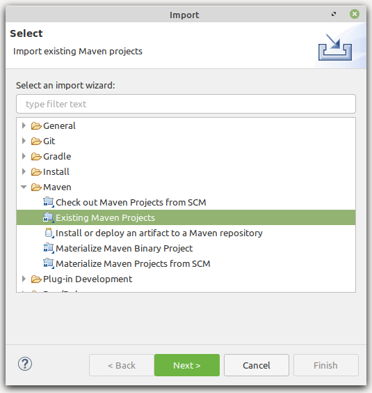
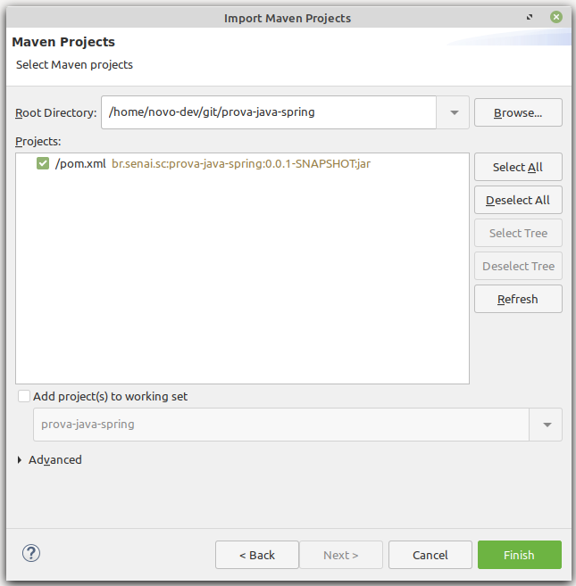
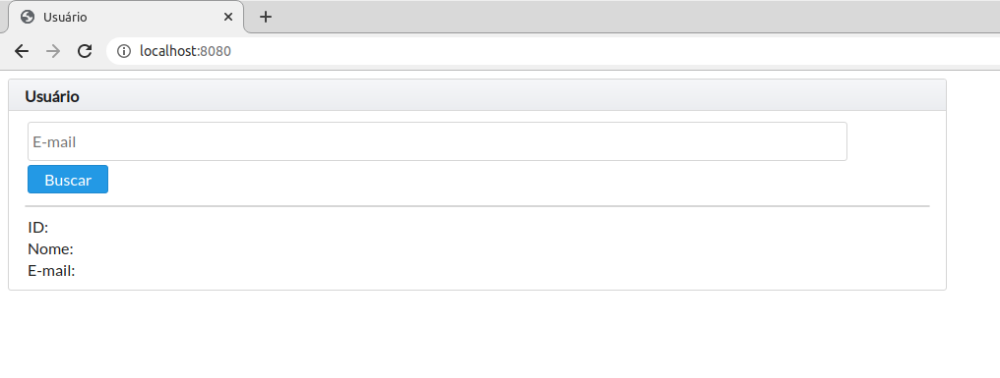

# Prova Java Spring IST - Configuração

O desenvolvimento da prova consiste em desenvolver telas(s) conforme especificado, em protótipos enviados por e-mail.

O projeto da prova utiliza a linguagem JAVA e o framework Spring (DI, JPA, JSF, MVC, etc).

Alguns pontos em relação ao desenvolvimento:
- Fique a vontade para adicionar mais libs, caso ache necessário. No entanto, essas devem ser adicionada ao projeto via maven (no arquivo pom.xml)
- A criação das tabelas, no banco de dados, são de forma automática, dependendo do que está modelado nas entidades.
- Os arquivos de exemplos estão organizados de forma adequada (MVC).
- Descreva ao final deste documento (Readme.md) o detalhamento de funcionalidades implementadas, sejam elas já descritas na modelagem e / ou extras.
- Detalhar também as funcionalidades que não conseguiu implementar e o motivo.
- Caso tenha adicionado novas libs, descreva quais foram e porque dessa agregação.
- As alterações realizadas na prova deve ser comitada diretamente na master/main do repositório, e não deve estar zipado.
- Caso ocorrer algum problema ao utilizar o banco no docker, pode-se utilizar sem o docker.

No mais, desenvolva com qualidade e boa prova :)
## Versão JDK

Utilizar a versão mais recente.

## Download da IDE

Baixar e descompactar o Spring Tools 4 for Eclipse (STS):

- [Windows][sts-windows]
- [Linux][sts-linux]
- [Mac][sts-mac]

Iniciar o STS escolhendo uma worksplace de sua preferência.

## Clone do repositório do projeto

Clonar esse repositório dentro da pasta do workspace utilizado no STS.

## Clone do repositório do banco de dados

Instalar o docker: https://www.docker.com/get-started > Docker Desktop

O banco de dados é criado via docker e o fonte está disponível em https://github.com/CETEC-DIGI/prova-java-remoto-banco

Após o clone, ir via terminal na pasta extraida e executar o banco pelo docker: `docker-compose up -d`

OBS: Se atentar que não pode haver nenhum servidor postgres rodando na máquina, se tiver, necessário fechar todos os serviços, assim como
qualquer outro serviço que esteja utilizando a porta 5432. Para verificar se o docker subiu corretamente, realizar a conexão com o banco:
- host: localhost
- port: 5432
- database: ist
- user: ist
- password: ist

## Configuração da IDE

- O Projeto está configurado para utilização do [Lombok][lombok], porém fique a vontade para usar ou não. Para configurá-lo na IDE clique em [Lombok][lombok].

- Ir em "File > Import..." e escolher a opção conforme segue:

  

- Selecionar a pasta do projeto e confirmar como segue:

  

- Em *Select root repository* escolher a pasta do projeto e clicar em *Finish*.

## Subindo a aplicação

- Selecionar o projeto:
- No combo do botão run circulado na imagem abaixo, escolher a opção Run As e depois Spring Boot App.

  

- No navegador digitar http://localhost:8080/, irá mostrar uma tela inicial conforme abaixo:

  

[sts-windows]: https://download.springsource.com/release/STS4/4.11.0.RELEASE/dist/e4.20/spring-tool-suite-4-4.11.0.RELEASE-e4.20.0-win32.win32.x86_64.self-extracting.jar

[sts-linux]: https://download.springsource.com/release/STS4/4.11.0.RELEASE/dist/e4.20/spring-tool-suite-4-4.11.0.RELEASE-e4.20.0-linux.gtk.x86_64.tar.gz

[sts-mac]: https://download.springsource.com/release/STS4/4.11.0.RELEASE/dist/e4.20/spring-tool-suite-4-4.11.0.RELEASE-e4.20.0-macosx.cocoa.x86_64.dmg

[lombok]: https://projectlombok.org/setup/eclipse

# Descrição do projeto

O arquivo frontend do projeto se encontra no github  https://github.com/caiorodriveira/front-prova-spring 

##

Inicialmente o projeto conta com 3 models a mais, que se referem as entidades do banco: Pessoa, Conta e Historico, onde é armazenado os dados informados nos formulários. Alguns dos atributos dos models contém anotações do tipo @JsonIgnore, nesse caso, eles são ignorados no momento de montar os objetos para as requisições, isso previne redundância dnas responses.

Foi adicionado um pacote DTO, abreviação para Data Transfer Object, nesse pacote contém as classes para uma personalização mais específica do response.

No pacote Repository foram implementadas as interfaces referente aos models criados usando o JPARepository.

No pacote de services foram implementadas as classes de serviço referente aos models que utilizam do repository criado, com os métodos para realizar as funções do JPA da manipulação do banco (SELECTs, INSERTs, UPDATE...). 

No pacote de controllers é onde organiza as classes que implementam a lógica de controle do sistema web baseado em Spring MVC (Model-View-Controller). Nos controllers, também é onde se encontra o tratamento e as condções dos dados recebidos.

Foi adicionado um pacote de movimentacoes, onde está presente a classe que estrutura o objeto das transações junto ao controller de movimentação, fazendo as requisições dos services: historico e conta, para gerar o extrato e as operações.

Foi adicionado um pacote de exceptions, nele esta presente apenas uma classe (NotFoundException), que extende a classe Exceptions do Java, para tratar erros de condições de dados não encontrados.

No pacote de config, foi adicionada uma classe para habilitar o CORS Origin, que permite os métodos na mesma URL (localhost) 

Além dos dados serem tratados no back-end, no front também valida os campos para envio e trata os erros para uma interação melhor com o usuário

### Alterações extras:

 - Atulização da versão do spring para uma versão mais atual no pom.xml e do maven

 - remoção do joinfaces, pois as paginas serão geradas pelo framework angular externamente

 - adição da dependência devtools, para reiniciar o back-end automaticamente com as alterações salvas 

 - Alteração na conexão com banco para máquina local (sem docker)

### Informações sobre o FRONT-END

 - A organização de diretórios e componentes no front-end é definida da seguinte forma: 

 - - Os arquivos principais se encontram na pasta `src`.

 - - Na pasta environments, contem um arquivo .ts que exporta uma classe com o endereço padrão da API

 - - O arquivo index.html, importa bibliotecas de estilização e faz referência a tag app-root que se refere ao arquivo app.component.html, localizado na pasta `app`

 - - A pasta app contém os diretórios components, pages, services e os arquivos app.component, que além dos arquivos padrões, se encontra o de roteamento de páginas app-routing.module.ts e o de importação de bibliotecas e declaração de páginas app.module.ts.

 - - Na pasta `components`, estão presentes os componentes da tela, no caso apenas o header.

 - - Na pasta `pages`, estão presentes as páginas de interação: pessoas, contas e movimentação.

 - - Na pasta `services`, estão presentes os diretórios com os arquivos de serviços, que fazem as requisições HTTP ao servidor.
